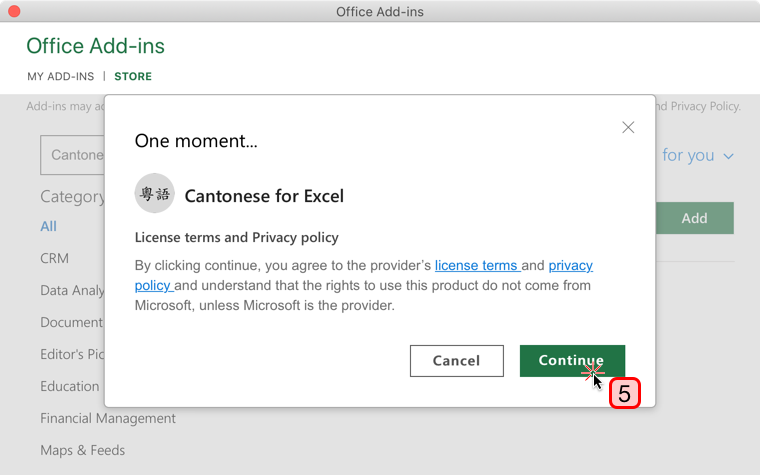

# Cantonese for Excel

This Excel Add-in provides formulas to facilitate working with Cantonese romanization in Excel.

These formulas do their best to convert the parts that they understand and leave things alone that they do not understand. This should allow you to intersperse English or 中文字 with your romanization and have them pass through correctly.

## Table of Contents

- [Installation](#installation)
  * [Large Screen](#large-screen)
  * [Small Screen](#small-screen)
  * [Office Add-ins Pop-up Window](#office-add-ins-pop-up-window)
- [Formulas](#formulas)
  * [Quick Reference](#quick-reference)
  * [`CANTONESE.JYUTPINGTOYALE`](#-cantonesejyutpingtoyale-)
    + [Usage Examples](#usage-examples)
    + [Input](#input)
    + [Output](#output)
- [Legal](#legal)
  * [Add-in End-User License Agreement](#add-in-end-user-license-agreement)
  * [Add-in Privacy Policy](#add-in-privacy-policy)
  * [Code License](#code-license)
- [Development](#development)
  * [Testing Locally](#testing-locally)
  * [Build & Release Excel for Cantonese](#build---release-excel-for-cantonese)
  * [Submission Details for Microsoft Partner Center](#submission-details-for-microsoft-partner-center)

## Installation

[You can install Cantonese for Excel directly from the Microsoft 365 Add-in Store.](https://appsource.microsoft.com/en-us/product/office/WA200002575) You can also install it from within Excel. The interface is slightly different between large and small screens.

### Large Screen

1. First, select the **Insert** tab on the Ribbon.
2. Select **Get Add-ins**.


### Small Screen

1. First, select the **Insert** tab on the Ribbon.
2. Select **Add-ins**.
3. In the drop-down that appears, select **Get Add-ins**


### Office Add-ins Pop-up Window

1. In the **Office Add-ins** pop-up window that appears, select **STORE**.
2. In the search field of the pop-up window, type "Cantonese"
3. Press the search button.
4. Press the **Add** button.
5. Press the **Continue** button in the confirmation screen.
6. Congratulations! Cantonese for Excel is now installed!




## Formulas

### Quick Reference

| Formula | Arguments | Description |
|---|---|---|
| [CANTONESE.JYUTPINGTOYALE](#CANTONESEJYUTPINGTOYALE) | string | Convert Jyutping to Yale |

### `CANTONESE.JYUTPINGTOYALE`

#### Usage Examples

| Cell Contents | Details |
|---|---|
| `=CANTONESE.JYUTPINGTOYALE("jyut6ping3")` | You may pass a string directly into this formula. |
| `=CANTONESE.JYUTPINGTOYALE(A1)` | You may pass a cell reference into this formula. |

#### Input

- The input string for this function may contain any amount of text.
- The input string does not have to be exclusively Jyutping and may contain English, 中文字, punctuation, and more.
- Your Jyutping elements may be adjacent or space separated.
- The input string may contain capitalization.

#### Output

- The output string is best effort. It will only transform things that it can confidently identify as Jyutping.
- Capitalization patterns are preserved, whether lower case, initial caps, or all caps.

***

## Legal

### Add-in End-User License Agreement

[The Cantonese for Excel Add-in is offered under the End-User License Agreement specified here.](.legal/EULA.pdf)

### Add-in Privacy Policy

The Cantonese for Excel Add-in does not collect or make use of any user information or data.

The Cantonese for Excel Add-in loads assets from Content Delivery Networks provided by Microsoft and GitHub's GitHub Pages product. Each of these providers may receive your IP address when those requests are made.

### Code License

The code in this repository is not licensed for reuse.

## Development

### Testing Locally

```sh
npm run stop
rm -rf dist
npm run build
npm run start
```

### Build & Release Excel for Cantonese

```sh
git checkout master
git clean -fdx
npm ci
npm version patch
npm run build
git branch -D gh-pages
git checkout --orphan gh-pages
git rm -r --cached ./
git add -f dist
git commit -m "Release"
git push -f --set-upstream origin gh-pages
git checkout -f master
git push origin master
```

### Submission Details for Microsoft Partner Center

```md
This Excel Add-in enables transformation between different types of Cantonese romanizations. No testing accounts are required.

Testing:
=CANTONESE.JYUTPINGTOYALE("nei5hou2")

Expected Output:
"néihhóu"
```
